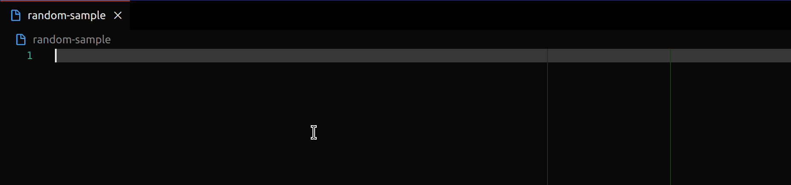

# Random Sample

Sample data from URLs, your local files or the active editor.

### Table of Contents

- [Features](#features)
- [Commands](#commands)
- [Configuration](#configuration)

## Features

This extension offers a quick and easy way to sample random data. It has 2 basic modes:

- Select a sample of random lines in the currently open editor
- Insert a sample of random lines from a specified file or URL

Additionally `Quick Samples` can be set up in the settings to quickly insert common sample settings.
This also allows specifying a list of entries instead of a file or URL.

## Commands

This extension contributed the following commands:

- `Random Sample: Select Sample of random Lines`
  - Selects the specified amount of random lines in the active editor
- `Random Sample: Select Single random Line`
  - Selects a random line in the active editor
- `Random Sample: Insert random Sample from File`
  - Inserts the specified amount of random lines from a file or URL
- `Random Sample: Insert single random Line from File`
  - Inserts a single random line from a file or URL
- `Random Sample: Insert random Sample again from previous File`
  - Inserts the specified amount of random lines from the previous file or URL
- `Random Sample: Insert single random Line again from previous File`
  - Inserts a single random line from the previous file or URL
- `Random Sample: Insert Quick Sample`
  - Inserts a sample from a Quick Sample specified in the settings

## Configuration

- `random-sample.defaultSize`
  - default size of the sample shown in the prompt
  - default `10`
- `random-sample.initialSampleFile`
  - Sample file used when sampling `again` without selecting a file (URL or file path)
- `random-sample.skipLines`
  - Skip lines at the beginning of the file (mapped by file ending)
  - default `{ csv: 1 }`
- `random-sample.allowDuplicatesOnOversizedSample`
  - Allow duplicate lines on oversized sample (Requested sample is larger than available lines)
  - default `false`
- `random-sample.skipEmptyLines`
  - Skip Empty lines (one of `"file"`, `"selection"`, `"true"`, `"false"`)
  - default `true`
- `random-sample.quickSamples`
  - Quick Samples to insert predefined Samples from a file or URL
  - default `[Examples of simple Quick Samples]`
